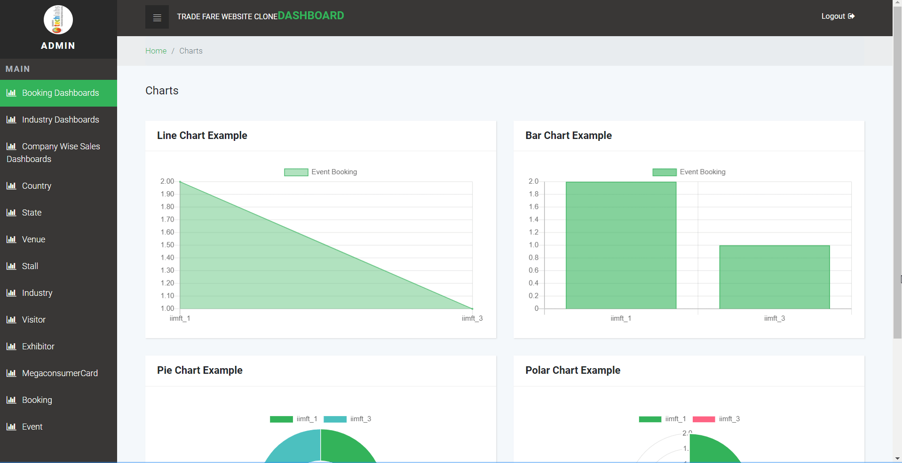
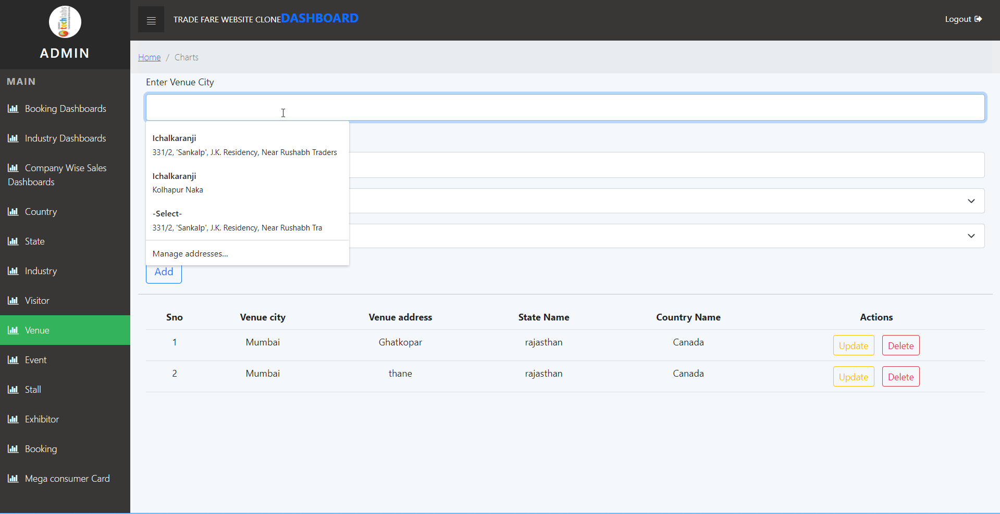
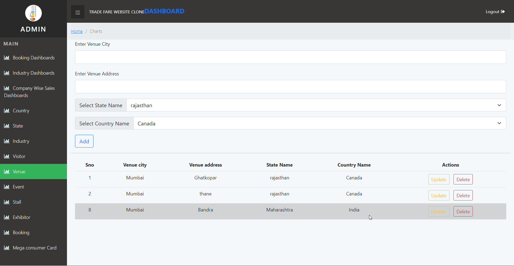

<h1 align="center">Database Management System (Trade Fare Website Clone)</h1>
  

<b>What does this website do?</b>

 

|    | Problems Solved Using The Website                                                                                                                                                |
|----|------------------------------------------------------------------------------------------------------------------------------------------------------------------------|
| 1. | The trade fare website is a database management system where the organizers, visitors, and exhibitors can add, delete, and update the details on their respective needed pages                                                                                                                       |
| 2. | It has pages to help organizers track country states, venues, events, and industries                                                                                                                                        |
| 3. | It has pages to help exhibitors enter the details and to help them make bookings for particular events                                                                                                                                  |
| 4. |It has pages to help the visitors track their spending-related details of particular events with particular exhibitors                                                                                                                               |
| 5. |It has dashboards for better visualization of company_sales, the total number of exhibitors industry-wise, and the total number of exhibitors taking part in particular events                                                                                                                                      |
| 6. |The website is fully mobile responsive and can work on any device                                                                                                                                       |

  

<b>Mentor</b>

 

[Sushant Bansal (Analyst Wissen Technologies)](https://www.linkedin.com/in/sushant-bansal-0263b0192/)

  

<b>Tools</b>

 

|    | Technologies Used                                                                                                                                                      |
|----|------------------------------------------------------------------------------------------------------------------------------------------------------------------------|
| 1. | HTML, CSS, JS, BOOTSTRAP for building mobile responsive frontend                                                                                                                          |
| 2. | MySQL for storing data                                                                                                                                          |
| 3. | Node.js and Express for backend                                                                                                                                    |
| 4. | EJS (Embedded Javascript Templating) for dynamic rendering of data(database) to frontend                                                                                                                                   |
| 5. | Charts.js for dynamic rendering of plots to frontend                                                                                                                                      |

   
  

<b>Video Demonstration</b>

 
<h4>Entity Relationship Diagram</h4>
 </img>  
<h4>Dashboard</h4>
</img>  
<h4>Adding new data and reflecting the same on the Database. </h4>
</img>  
<h4>Updating the existing data and reflecting the same on Database.</h4>
</img>
<h4>Deleting the data and reflecting the same on Database.</h4>
</img>

      

<b>Things Achieved During The Project  </b>

 

|    | Things Achieved During The Project                                                                                                                                     |
|----|------------------------------------------------------------------------------------------------------------------------------------------------------------------------|
| 1. | Learned to make Entity Relationship Diagram and build a database from scrap                                                                                                                                    |
| 2. | Connected all the tables in proper format and implemented it using MySQL                                                                                                    |
| 3. | Implemented backend using Node.js, Express(Node.js Framework)                                                                                                                          |
| 4. | Connected database with Node.js, Express (backend) using JS                                                                                                                          |
| 5. | Used EJS templating for dynamic rendering of data from database to frontend                                                                                                                        | 
| 6. | Implemented all the CRUD operations i.e. add, update, delete operations                                                                                              |     
| 7. | Learned dynamic rendering of plots in frontend using Charts.js                                                                                             |     |

 

  
  

